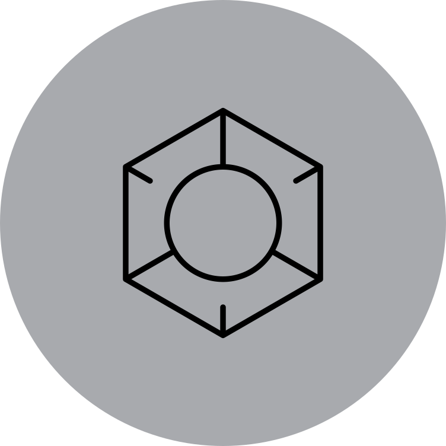

 

  
  <h3 align="center">AR Decor</h3>
  
<i>An AR decor showcase using Unity and the Vuforia SDK</i>

  
Table of Contents

  <ol>
    <li><a href="#about">About</a></li>
    <li><a href="#requirements">Requirements</a></li>
    <li><a href="#working">Working</a></li>
    <li><a href="#how-to-run">How To Run</a></li>
    <li><a href="#license">License</a></li>
  </ol>

## About
An AR decor showcase which allows customers to virtually try out furniture & decorations through markers, letting them position objects however they like in real time.  
 
##### Some quick details:

- Made in: Unity 2021.3
- Language: C#
- AR engine: Vuforia
- Platform: Android

## Working

## Requirements
To open the source project in Unity, sign up for a Vuforia Developer account, download the `com.ptc.vuforia.engine-10.11.3.tgz` package and add it to `Packages/`.

## How To Run
Download `AR Decor.apk` from the [Releases](https://github.com/ArcticKangaroo/50-Shooter/releases/) page. Transfer to your Android device and install.

## License
Distributed under the MIT License. See `LICENSE` for more information.
